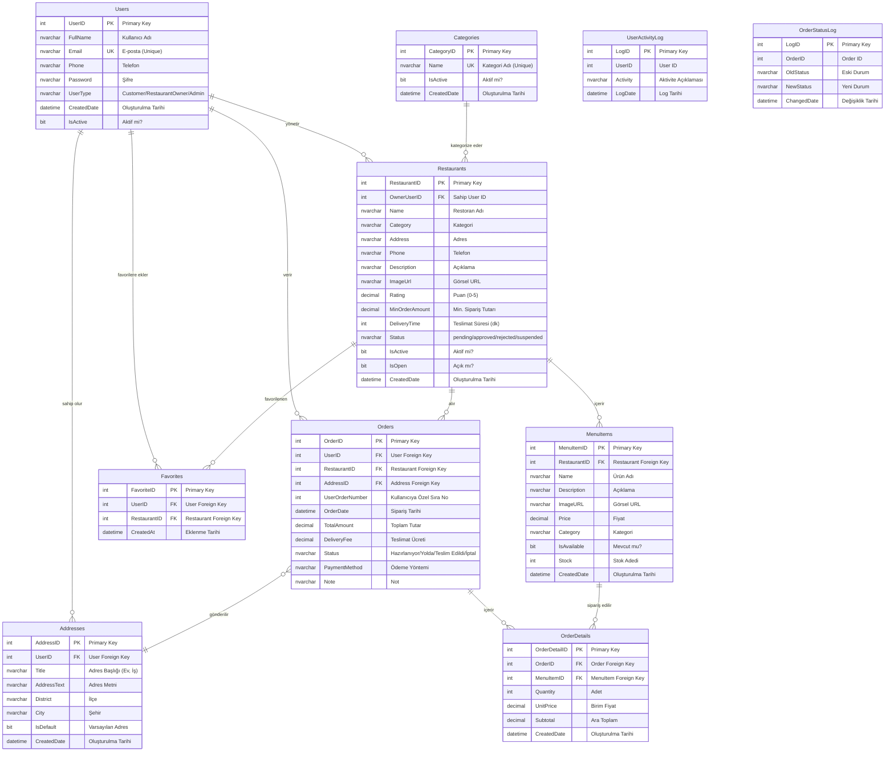

# Yemeksepeti - Veritabanı ER Diyagramı

## Entity-Relationship Diagram

## Tablo Açıklamaları

### Ana Tablolar

#### **Users (Kullanıcılar)**
- Sistemdeki tüm kullanıcıları tutar (müşteriler, restoran sahipleri, adminler)
- `UserType`: Customer, RestaurantOwner veya Admin
- Email benzersiz (unique) olmalıdır

#### **Restaurants (Restoranlar)**
- Platformdaki tüm restoranları saklar
- `Status`: pending (beklemede), approved (onaylı), rejected (reddedildi), suspended (askıya alındı)
- `OwnerUserID`: Restoranı yöneten kullanıcının ID'si

#### **MenuItems (Menü Öğeleri)**
- Her restorana ait ürünleri içerir
- Kategori, fiyat, görsel ve stok bilgisi

#### **Orders (Siparişler)**
- Müşteri siparişlerini saklar
- `UserOrderNumber`: Her kullanıcı için 1'den başlayan sipariş numarası
- Durum takibi: Hazırlanıyor → Yola Çıktı → Teslim Edildi

#### **OrderDetails (Sipariş Detayları)**
- Siparişteki her ürünün detaylarını tutar
- Adet, birim fiyat ve ara toplam bilgileri

#### **Addresses (Adresler)**
- Kullanıcıların kayıtlı teslimat adreslerini saklar
- Bir adres varsayılan (IsDefault) olarak işaretlenebilir

#### **Categories (Kategoriler)**
- Restoran kategorilerini tanımlar
- Örnek: Burger, Pizza, Kebap, Tatlı, Kahve

#### **Favorites (Favoriler)**
- Kullanıcıların favori restoranlarını saklar
- Her kullanıcı-restoran çifti benzersiz olmalıdır

### Log Tabloları

#### **UserActivityLog**
- Kullanıcı aktivitelerini izlemek için trigger tarafından kullanılır

#### **OrderStatusLog**
- Sipariş durum değişikliklerini izlemek için trigger tarafından kullanılır

## İlişkiler

1. **Users → Addresses**: Bir kullanıcının birden fazla adresi olabilir (1:N)
2. **Users → Orders**: Bir kullanıcı birden fazla sipariş verebilir (1:N)
3. **Users → Restaurants**: Bir restoran sahibi birden fazla restoranı yönetebilir (1:N)
4. **Users → Favorites**: Bir kullanıcının birden fazla favori restoranı olabilir (1:N)
5. **Restaurants → MenuItems**: Bir restoranın birden fazla menü öğesi vardır (1:N)
6. **Restaurants → Orders**: Bir restoran birden fazla sipariş alabilir (1:N)
7. **Orders → OrderDetails**: Bir siparişte birden fazla ürün olabilir (1:N)
8. **Orders → Addresses**: Her sipariş bir adrese gönderilir (N:1)
9. **MenuItems → OrderDetails**: Bir menü öğesi birden fazla siparişte olabilir (1:N)

## Kısıtlamalar (Constraints)

- **Primary Keys**: Tüm tablolarda IDENTITY(1,1) ile otomatik artan birincil anahtarlar
- **Foreign Keys**: İlişkili tablolar arasında referans bütünlüğü
- **Unique Constraints**: 
  - Users.Email
  - Categories.Name
  - Favorites (UserID, RestaurantID) kombinasyonu
- **Default Values**: CreatedDate, IsActive, Rating, Status gibi alanlar için varsayılan değerler

## Trigger'lar

1. **trg_SetUserOrderNumber**: Yeni sipariş eklendiğinde otomatik UserOrderNumber atar
2. **trg_LogUserActivity**: Kullanıcı işlemlerini UserActivityLog tablosuna kaydeder
3. **trg_LogOrderStatus**: Sipariş durum değişikliklerini OrderStatusLog tablosuna kaydeder

## Stored Procedures

- **sp_GetRestaurants**: Restoranları filtreler ve listeler
- **sp_GetMenuItems**: Belirli bir restoranın menü öğelerini getirir
- **sp_CreateOrder**: Yeni sipariş oluşturur
- **sp_UpdateOrderStatus**: Sipariş durumunu günceller

## Views

- **vw_OrderDetails**: Sipariş detaylarını zenginleştirilmiş halde gösterir
- Kullanıcı, restoran, ürün bilgilerini birleştirerek kolay raporlama sağlar
